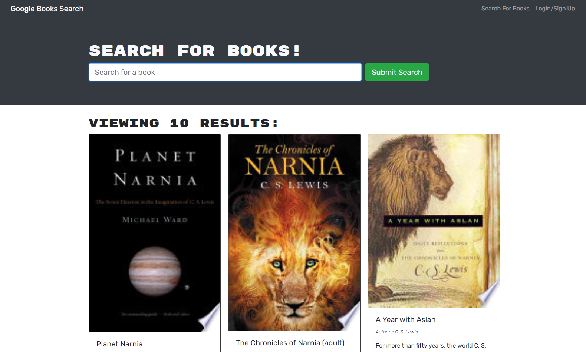

# Book Search Engine 

## Description 
This app allows users to search for books, view a brief description of them save them to their profile. This app utilizes Google Books API for a smooth experience.

## Installation
You will need to clone the repo and install dependencies using npm i. Make sure MongoDb is installed and run the server

## Built with 
- HTML/CSS
- JavaScript
- MERN

## Screenshot
